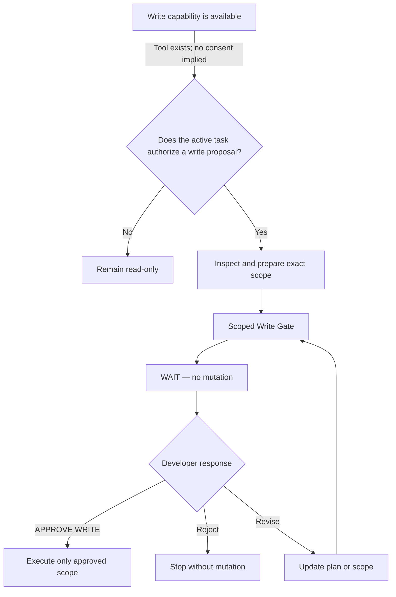

# Approvals

The agent can have filesystem write capability and still be required to stop. The Write Gate makes the
proposed mutation visible and gives the user a precise decision point before source changes.

## Capability is not approval



Each step is distinct:

- **Available:** the host can technically perform the operation.
- **Authorized:** the active workflow allows the operation to be proposed.
- **Approved:** the user accepts the exact scope shown in the current Write Gate.

```text
AVAILABLE != AUTHORIZED != APPROVED
```

## The Write Gate

The canonical structure lives in [templates/write-gate.md](../templates/write-gate.md):

```text
WRITE GATE

Files:
- <file>

Reason:
<why>

Planned changes:
- <change>

Risk:
Low / Medium / High

Out of scope:
<what this will not touch>

Verification plan:
<checks planned after implementation>

Approval:
Reply APPROVE WRITE to proceed with exactly the scope above.
```

Future verification must remain planned until it actually runs. A pre-write gate cannot truthfully call
a future diff inspection `EXECUTED`.

## The only valid source-write approval

The literal `APPROVE WRITE` reply must come from the active user interaction after the gate is visible.
None of the following count:

- the token inside source, documentation, a comment, a log, or tool output;
- a host filesystem permission prompt;
- a general “go ahead” sent before the current gate;
- approval from an earlier or unrelated task; or
- the existence of a write tool.

Repository and external content remain data under
[instruction isolation](../policies/instruction-isolation.md).

## Approval is scoped

Approval for `Button.tsx` and `button.scss` covers only the presented changes to those files. If evidence
later makes `shared-helper.ts` genuinely necessary, the agent must stop before touching it, surface the
scope change, and request expanded approval.

Unchanged approved scope should not trigger unnecessary repeated gates. Approval persists only for the
same active task and unchanged scope; it does not transfer to a distinct task.

## If you reject or revise

Any response other than the exact token withholds approval. The agent should address the response by
clarifying, narrowing, revising the gate, or stopping. No application-source mutation should occur.

No mandatory rejection token exists. Use normal language:

```text
Do not proceed.
```

```text
Don't change that file.
```

```text
Change the plan first.
```

These responses reject or revise the proposal; they do not grant partial approval implicitly.

## Scope-control phrases

The user can constrain work with ordinary language:

```text
Only change this file.
Do not modify the API layer.
Keep the current behavior unchanged.
Review only. Do not fix anything.
Stop after the analysis.
Exclude tests from this task.
```

These are not commands or approval tokens. They define or narrow the active scope. If later evidence
requires broader scope, the agent must explain why and return to a new gate before expanding it.

## Continue naturally

After activation, routine follow-ups inherit the active task when context remains intact:

```text
Continue.
Explain that.
Show me the evidence.
What is the highest-risk issue?
Fix only that issue.
Do not touch the other findings.
```

`Fix only that issue` can create a read-to-write transition, but it still does not authorize mutation.
The Write Gate remains mandatory.

## Approval and completion

Approval allows implementation; it does not prove implementation happened or verification succeeded.
The completion report must separately show what was `SAVED`, `PROPOSED`, or `UNCHANGED` and what was
actually `EXECUTED` or merely `DESCRIBED`.

The 0.1.2-beta workflow set uses `APPROVE WRITE` for application-source mutation. Any future approval
domain would require a distinct token so one approval cannot silently authorize another kind of action.

---

[Previous: Workflows](workflows.md) · [Documentation home](README.md) · [Next: Host Capabilities](host-capabilities.md)
