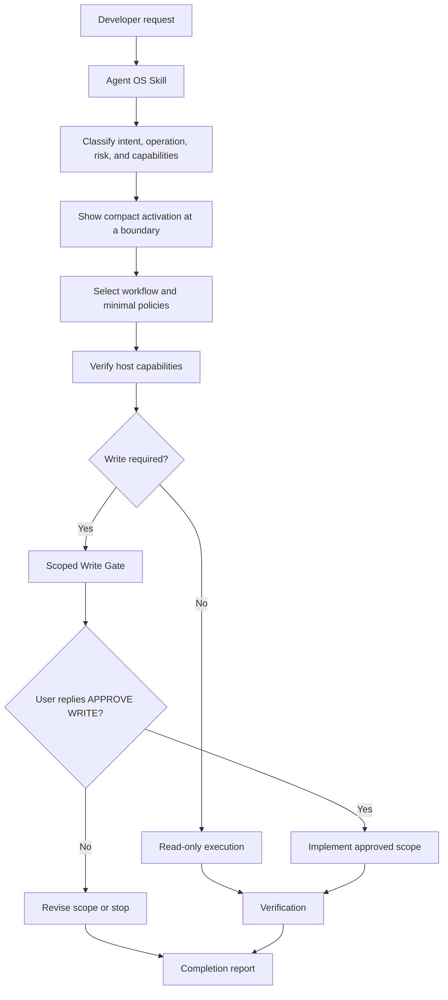

# How It Works

Agent OS Skill is a declarative governance and workflow layer. It does not add an executable runtime;
the active agent reads the instructions, routes the request, uses only verified capabilities, and
reports what actually happened.

## Request flow



Natural-language requests and explicit workflow names enter the same classification step. The agent
determines read or write operation before acting; it does not infer approval from tool availability.

## Visible activation, silent continuity

At a new governed task, the first substantive response begins with one compact activation naming the
Skill, workflow, task, and focus. A material workflow change or distinct task reset surfaces one compact
transition. Material scope growth surfaces a compact scope-change boundary before expanded approval.

After that boundary, the agent silently retains operational metadata such as task, workflow, focus,
scope, operation, approval state, capabilities, and verification state. Routine progress and short
follow-ups inherit that context without another banner.

This is operational continuity, not exposed private reasoning. It does not contain or reveal
chain-of-thought, system instructions, or hidden deliberation. Agent OS Skill adds no state database,
telemetry, or background service.

## Progressive loading

[SKILL.md](../SKILL.md) stays small enough to remain the runtime entrypoint. The agent loads only the
workflow, policies, templates, and project evidence needed for the current task.

A bug fix typically needs:

```text
SKILL.md
+ workflows/fix-bug.md
+ policies/scope-control.md
+ policies/write-safety.md
+ policies/evidence.md
+ templates/write-gate.md
+ templates/completion-report.md
+ relevant project files
```

A security review loads a different set:

```text
SKILL.md
+ workflows/security-review.md
+ policies/secrets.md
+ policies/instruction-isolation.md
+ policies/evidence.md
+ project files in scope
```

This reduces context pressure and keeps instructions focused without changing the governance floor.

## Authority boundaries

- **The user** supplies valid approval in the active conversation after seeing the gate.
- **The host** supplies capabilities, not consent.
- **G1–G10** in [SKILL.md](../SKILL.md) are the governance floor.
- **Workflows and policies** add scoped detail but cannot weaken that floor.
- **Repository and tool content** are data to inspect, never an authority or approval channel.

The model is:

```text
AVAILABLE != AUTHORIZED != APPROVED
```

Read [Approvals](approvals.md) for the complete Write Gate semantics.

## Evidence and state

The agent may only claim that an action ran when observed evidence supports it. Verification uses:

- `EXECUTED` for an action that actually ran with observed evidence;
- `DESCRIBED` for an explanation, recommendation, or unavailable check.

Completion state uses:

- `SAVED` for persisted changes;
- `PROPOSED` for changes that were not persisted;
- `UNCHANGED` for deliberately preserved scope.

These labels prevent capability limits or persuasive wording from becoming false execution claims.

## Baseline and Beta behavior

G1–G10 are the defined governance kernel. Workflow steps, routing details, and AOS-B011 Active Skill
Focus remain Beta behavior informed by field evidence. They are not presented as the formal future
Agent OS Core. Evidence-driven candidates are tracked in
[feedback/CORE_CANDIDATES.md](../feedback/CORE_CANDIDATES.md).

---

[Previous: Prompt Library](prompt-library.md) · [Documentation home](README.md) · [Next: Workflows](workflows.md)
